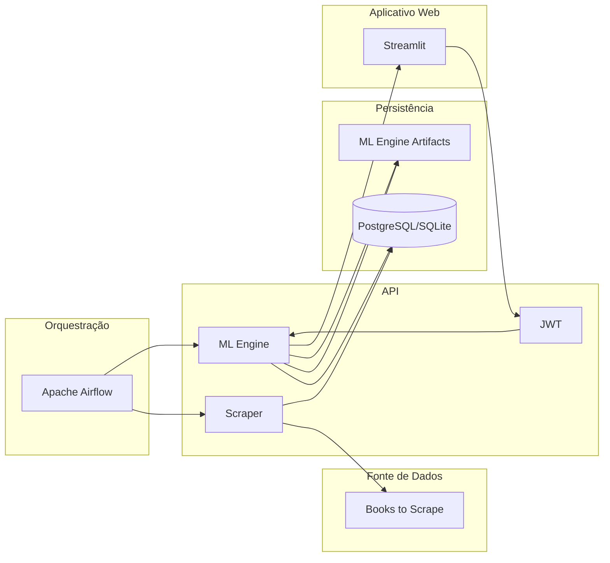

# Repositório do Streamlit para o Tech Challenge da Fase 1 da Pós-Graduação em Machine Learning Engineering da FIAP

Este repositório consiste em um aplicativo web desenvolvido com Streamlit e cujo objetivo é disponibilizar uma interface de usuário intuitiva e responsiva, projetada para o consumo das funcionalidades da API BooksToScrape.

Como resultado, a solução consolidou uma experiência de navegação completa que abrange o gerenciamento de identidade, através de fluxos de cadastro e login e a exploração dinâmica do catálogo por meio de filtros de preço, gênero e título. Ademais, o aplicativo integra-se ao motor de recomendação para fornecer recomendações personalizadas e disponibiliza um dashboards para a visualização de indicadores do acervo.

### Arquitetura

O diagrama abaixo ilustra a arquitetura do projeto na sua integridade e com suas principais funcionalidades:



### Pré-requisitos

Certifique-se de ter o Python 3.11 e o Poetry instalados.

Para instalar o Poetry, use o método oficial:
```bash
curl -sSL https://install.python-poetry.org | python3 -
```

### Instalação

Clone o repositório e instale as dependências listadas no `pyproject.toml`:

```bash
git clone https://github.com/jorgeplatero/postech-ml-techchallenge-fase-1-streamlit.git
cd postech-ml-techchallenge-fase-1-streamlit
poetry install
```

### Como Rodar a Aplicação

**Via Docker (Recomendado):**

Execute o comando abaixo para subir o ambiente completo (API + Dependências):

```bash
docker-compose up --build
```

**Local:**

Para iniciar o servidor do Streamlit localmente:

```bash
poetry run streamlit run main.py
```

O aplicativo estará disponível em `http://localhost:8501`. 

Certifique-se de que a API esteja em produção para que o aplicativo possa autenticar e buscar os dados.

### Funcionalidades

#### Autenticação

O aplicativo implementa um fluxo completo de controle de acesso e persistência de sessão.

*   **Cadastro e Login:** interfaces dedicadas para criação de novas contas e autenticação de usuários existentes, integradas ao sistema de permissões da API

#### Acervo

Módulo projetado para o consumo dinâmico do catálogo de livros com foco em experiência de usuário (UX).

*   **Filtros:** painel latera com controles para alternar entre buscas por título/gênero e/ou faixa de preço
*   **Navegação:** exibição do catálogo organizada em grids responsivos, apresentando capas, preços e avaliações
*   **Detalhamento:** uso de janelas de diálogo para exibição de informações técnicas completas e descrições semânticas sem perda de contexto da navegação
*   **Recomendações:** carrossel paginado e interativo que apresenta livros com os maiores pontuações de similaridade calculados pelo modelo TF-IDF

#### Personalização 

Interface de interação direta com a camada de inteligência da aplicação para personalização do perfil.

*   **Preferências:** fluxo guiado onde o usuário seleciona gêneros de interesse e favorita título para alimentar o motor de recomendação

#### Estatísticas

Painel analítico para visualização de métricas de negócio e distribuição do acervo.

### Tecnologias

| Componente | Tecnologia | Versão | Descrição |
| :--- | :--- | :--- | :--- |
| **Frontend/App** | **Streamlit** | `^1.51.0` | Framework utilizado para a construção da interface interativa e dashboard |
| **Visualização** | **Plotly** | `^6.5.0` | Biblioteca de gráficos interativos para representação estatística dos dados |
| **Data Analysis** | **Pandas** | `^2.3.3` | Biblioteca utilizada para manipulação de dataframes e estruturação de tabelas |
| **Comunicação** | **Requests** | `^2.32.5` | Biblioteca para realizar requisições HTTP à API central e consumo de JSON |
| **Sessão** | **Cookies Controller**| `^0.0.3` | Ferramenta para gestão de persistência de tokens JWT e estado do usuário |
| **Linguagem** | **Python** | `>=3.11, <3.14` | Linguagem de programação base para o desenvolvimento dos scripts |
| **Infraestrutura** | **Docker** | `3.8 (Compose)` | Ferramenta de containerização que garante a paridade entre ambientes |
| **Gerenciamento** | **Poetry** | `2.2.1` | Gerenciador de pacotes e ambientes virtuais utilizado para garantir a reprodutibilidade das dependências do projeto |

### Integrações

Este aplicativo é a camada de consumo final e depende da comunicação com a API para funcionamento.

- **Repositório da API:** https://github.com/postech-mlengineering/postech-ml-techchallenge-fase-1-api

- **Repositório de Orquestração:** https://github.com/postech-mlengineering/postech-ml-techchallenge-fase-1-airflow/tree/main

### Deploy

O deploy deste aplicativo foi realizado via Streamlit Cloud, garantindo disponibilidade e integração contínua com este repositório.

Link para o aplicativo: https://bookstoscrape.streamlit.app/
