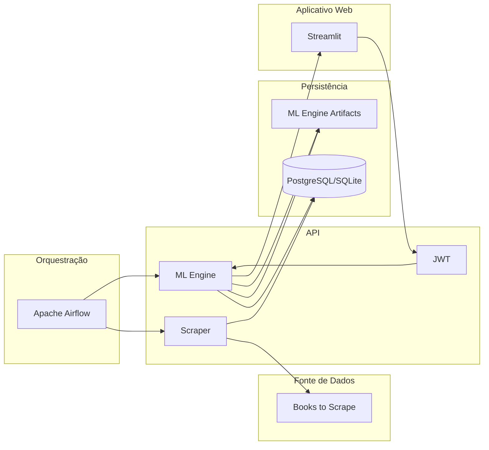

# Repositório do Aplicativo Web para o Tech Challenge da Fase 1 da Pós-Graduação em Machine Learning Engineering da FIAP

Este repositório consiste em um aplicativo web desenvolvido com Streamlit cujo objetivo é disponibilizar uma interface de usuário intuitiva e responsiva, projetada para o consumo das funcionalidades da API BooksToScrape.

Como resultado, a solução consolidou uma experiência de navegação completa que abrange o gerenciamento de identidade, através de fluxos de cadastro e login e a exploração dinâmica do catálogo por meio de filtros de preço, gênero e título. Ademais, o aplicativo integra-se ao motor de recomendação para fornecer recomendações personalizadas e disponibiliza um dashboards para a visualização de indicadores do acervo.

### Arquitetura

O diagrama abaixo ilustra a arquitetura do projeto na sua integridade e com suas principais funcionalidades:



### Pré-requisitos

Certifique-se de ter o Python 3.11 e o Poetry instalados.

Para instalar o Poetry, use o método oficial:
```bash
curl -sSL https://install.python-poetry.org | python3 -
```

### Instalação

Clone o repositório e instale as dependências:

```bash
git clone https://github.com/jorgeplatero/postech-ml-techchallenge-fase-1-streamlit.git
cd postech-ml-techchallenge-fase-1-streamlit
poetry install
```

### Como Rodar a Aplicação

**Docker:**

```bash
docker-compose up --build
```

**Local:**

```bash
poetry run streamlit run main.py
```

O aplicativo estará disponível em `http://localhost:8501`. 

Certifique-se de que a API esteja em produção para que o aplicativo possa autenticar e buscar os dados.

### Funcionalidades

#### Autenticação

O aplicativo implementa um fluxo completo de controle de acesso e persistência de sessão.

*   **Cadastro e Login:** interfaces dedicadas para criação de novas contas e autenticação de usuários existentes, integradas ao sistema de permissões da API

#### Acervo

Módulo projetado para o consumo dinâmico do catálogo de livros com foco em experiência de usuário (UX).

*   **Filtros:** painel latera com controles para alternar entre buscas por título/gênero e/ou faixa de preço
*   **Navegação:** exibição do catálogo organizada em grids responsivos, apresentando capas, preços e avaliações
*   **Detalhamento:** uso de janelas de diálogo para exibição de informações técnicas completas e descrições semânticas sem perda de contexto da navegação
*   **Recomendações:** carrossel paginado e interativo que apresenta livros com os maiores pontuações de similaridade calculados pelo modelo TF-IDF

#### Personalização 

Interface de interação direta com a camada de inteligência da aplicação para personalização do perfil.

*   **Preferências:** fluxo guiado onde o usuário seleciona gêneros de interesse e favorita título para alimentar o motor de recomendação

#### Estatísticas

Painel analítico para visualização de métricas de negócio e distribuição do acervo.

### Tecnologias

| Componente | Tecnologia | Versão | Descrição |
| :--- | :--- | :--- | :--- |
| **Frontend/App** | **Streamlit** | `^1.51.0` | Framework para desenvolvimento de aplicativo web |
| **Visualização** | **Plotly** | `^6.5.0` | Biblioteca para criação de gráficos dinâmicos e interativos |
| **Análise de Dados** | **Pandas** | `^2.3.3` | Biblioteca para manipulação de dados |
| **Comunicação** | **Requests** | `^2.32.5` | Biblioteca para requisições HTTP e consumo de API |
| **Sessão** | **Cookies Controller**| `^0.0.3` | Biblioteca para gestão de estados da sessão |
| **Linguagem** | **Python** | `>=3.11, <3.14` | Linguagem para desenvolvimento de scripts |
| **Infraestrutura** | **Docker** | `3.8 (Compose)` | Ferramenta de containerização para paridade entre ambientes |
| **Gerenciamento** | **Poetry** | `2.2.1` | Gerenciador de ambientes virtuais para isolamento de dependências |

### Integrações

Este aplicativo web faz requisições a uma API RESTful desenvolvida com Flask que gerencia o banco de dados e um motor de recomendação cujo fluxo de atualização e processamento é orquestrado pelo Apache Airflow.

Link para o repositório da API: https://github.com/postech-mlengineering/postech-ml-techchallenge-fase-1-api

Link para o repositório do Airflow: https://github.com/postech-mlengineering/postech-ml-techchallenge-fase-1-airflow/tree/main

### Deploy

A arquitetura e o deploy foram concebidos para suportar um ecossistema distribuído, utilizando a AWS (EC2) como provedor de infraestrutura e Docker para a padronização e o isolamento dos ambientes de execução.

A solução é composta por três camadas principais de containers integrados:

* **Orquestração (Apache Airflow)**: implementada em containers dedicados, esta camada é responsável pelo agendamento e execução dos pipelines de dados, acionando as rotas de /scrape e /training-data da API

* **API (Flask)**: é o coração da arquitetura, onde a lógica de negócio e o motor de recomendações reside. Esta camada interage com o site Books To Scrape para aquisição de dados via web scraping e expõe endpoints para consumo

* **Consumo (Streamlit)**: é a interface web que consome os serviços da API, permitindo que os usuários finais interajam com a API

A comunicação entre os containers é otimizada por meio da atribuição de rede comum no Docker, permitindo que os serviços interajam através de nomes de host predefinidos em vez de IPs dinâmicos, elevando a eficiência e performance ao processar o tráfego de dados localmente na interface do host, o que reduz a latência e elimina custos de saída.

#### Persistência

A camada de persistência é estruturada por meio de um banco de dados relacional gerenciado via Supabase (integrado à plataforma Vercel). Esta infraestrutura é responsável pela centralização do acervo de livros, pelo histórico de preferências de usuários e pela persistência dos logs de auditoria.
